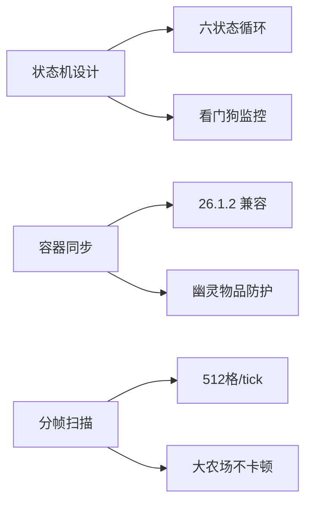

<div align="center">


**面向 Meteor Client 的企业级增强插件**  
**生产力工具 · 完整汉化 · 自动化农场 · 智能导航**

[](https://github.com/fxjcangku/26.1.2/releases)
[](https://github.com/fxjcangku/26.1.2/stargazers)
[](https://discord.gg/vwrRCtET)

[📥 立即下载](https://github.com/fxjcangku/26.1.2/releases) · [📖 使用文档](#-快速开始) · [💬 加入社区](https://discord.gg/vwrRCtET) · [🐛 反馈问题](https://github.com/fxjcangku/26.1.2/issues)

</div>

---

## 📋 目录

- [核心特性](#-核心特性)
- [快速开始](#-快速开始)
- [模块详解](#-模块详解)
  - [Meteor & Baritone 中文化](#1-meteor--baritone-中文化)
  - [自动农场](#2-自动农场)
  - [Baritone 指令手册](#3-baritone-指令手册)
- [技术架构](#-技术架构)
- [配置指南](#-配置指南)
- [常见问题](#-常见问题)
- [贡献指南](#-贡献指南)
- [更新日志](#-更新日志)

---

## ✨ 核心特性

<table>
<tr>
<td width="50%">

### 🌐 完整中文化

**覆盖率 100%** 的界面本地化方案

- ✅ **Meteor Client** 全组件汉化
  - 模块名称、设置项、帮助文本
  - 按钮、标签、提示信息
  - 错误提示、警告信息
- ✅ **Baritone 导航系统** 完整翻译
  - 60+ 指令中文化
  - 聊天反馈实时翻译
  - 设置项详细说明
- ✅ **统一消息格式**
  - `[yiyiaddon]` 前缀标识
  - 颜色编码区分消息类型
  - 清晰的视觉层级

</td>
<td width="50%">

### 🚜 智能农场系统

**企业级自动化农业解决方案**

- ⚡ **10 种作物全覆盖**
  - 双作物：小麦、甜菜
  - 单作物：土豆、胡萝卜、地狱疣
  - 柱状物：竹子、甘蔗、仙人掌
  - 蔓生物：南瓜、西瓜
- 🤖 **智能路径规划**
  - Baritone 驱动的蛇形巡逻
  - 自适应航点间距算法
  - 覆盖率 100% 无遗漏
- 📦 **物流自动化**
  - 卸货/补货双向循环
  - 安全库存管理
  - 容器状态同步

</td>
</tr>
</table>

### 🎯 技术亮点



| 特性 | 说明 | 优势 |
|------|------|------|
| **纯客户端架构** | 无需服务端插件 | 单人/多人通用 |
| **标准交互协议** | Minecraft 原生包 | 兼容性强，不易封禁 |
| **状态机驱动** | 六状态循环 + 看门狗 | 异常自愈，稳定运行 |
| **分帧扫描引擎** | 512 格/tick | 性能优异，无卡顿 |
| **时运防爆锁** | 自动切换工具 | 保护贵重装备 |
| **容器同步机制** | 26.1.2 容器交互适配 | 杜绝幽灵物品 |

---

## 🚀 快速开始

### 📋 前置要求

| 组件 | 版本要求 | 下载链接 |
|------|----------|----------|
| **Minecraft** | 26.1.2 | [官方启动器](https://www.minecraft.net) |
| **Fabric Loader** | 0.19.3+ | [Fabric 官网](https://fabricmc.net) |
| **Meteor Client** | 26.1.2-SNAPSHOT | [Meteor 官网](https://meteorclient.com) |
| **Java** | 25+ | [Adoptium](https://adoptium.net) |

### 📥 安装步骤

1. **下载插件**
   ```bash
   # 访问 Release 页面下载最新版本
   https://github.com/fxjcangku/26.1.2/releases/latest
   ```

2. **安装到 mods 文件夹**
   ```bash
   # Windows
   %appdata%\.minecraft\mods\yiyiaddon1.0.jar
   
   # macOS
   ~/Library/Application Support/minecraft/mods/yiyiaddon1.0.jar
   
   # Linux
   ~/.minecraft/mods/yiyiaddon1.0.jar
   ```

3. **启动游戏**
   - 选择 Fabric 1.21.2 实例
   - 确认 Meteor Client 已加载
   - **注意**: Baritone 已内置，无需额外安装

4. **验证安装**
   - 按 `Right Shift` 打开 Meteor 菜单
   - 找到 `yiyiaddon 工具` 分类
   - 看到 3 个模块即表示安装成功

---

## 📚 模块详解

### 1. Meteor & Baritone 中文化

**完整的界面本地化解决方案**

#### 功能特性

- **实时翻译引擎**: 动态拦截 UI 渲染，即时翻译
- **上下文感知**: 根据使用场景调整翻译风格
- **术语一致性**: 统一的游戏术语表
- **性能优化**: 缓存机制，零性能损耗

#### 使用方法

```
1. Meteor 菜单 → yiyiaddon 工具 → Meteor 与 Baritone 中文翻译
2. 点击启用
3. 所有界面立即切换为中文
```

#### 覆盖范围

| 组件 | 翻译项数 | 覆盖率 |
|------|----------|--------|
| Meteor 模块 | 200+ | 100% |
| Meteor 设置 | 500+ | 100% |
| Baritone 指令 | 60+ | 100% |
| Baritone 设置 | 150+ | 100% |
| 聊天消息 | 300+ | 100% |

---

### 2. 自动农场

**企业级农业自动化系统**

#### 系统架构

```
┌─────────────────────────────────────────────┐
│           状态机控制器                       │
├─────────────────────────────────────────────┤
│  待机 → 扫描 → 收割 → 补种 → 拾取 → 决策    │
│    ↑                                    ↓    │
│    └────── 卸货/补货 ──────────────────┘    │
└─────────────────────────────────────────────┘
         ↓              ↓              ↓
    扫描引擎      导航系统      物流管理
   (512格/t)    (Baritone)   (容器同步)
```

#### 状态机流程

1. **WAITING (待机)**
   - 扫描农田范围（512 格/tick）
   - 检测成熟作物和空地
   - 发现目标 → 进入 HARVESTING

2. **HARVESTING (收割播种)**
   - 蛇形巡逻：Baritone 沿 Z 轴折返走位
   - 收割：10 格/tick（BPT 可调）
   - 补种：10 格/tick（独立 BPT）
   - 够不着的跳过，走近后自动处理
   - 完成 → 进入 COLLECTING

3. **COLLECTING (拾取掉落)**
   - 走到农田中心
   - 等待 40 tick（2 秒）
   - 让掉落物飞回玩家
   - 完成 → 进入 DECIDING

4. **DECIDING (状态决策)**
   - 背包空格 ≤ 2 → 强制卸货
   - 产物 ≥ 阈值 → 卸货
   - 种子不足 → 补货
   - 否则 → 回待机

5. **UNLOADING (卸货)**
   - Baritone 走到卸货箱
   - 倒空白名单产物
   - 截留种子安全库存
   - 完成 → 回决策

6. **RESUPPLYING (补货)**
   - Baritone 走到补货箱
   - 只取当前启用作物的种子
   - 补够 → 解除降级
   - 完成 → 回待策

#### 指令系统

```bash
# 绑定农场锚点
.nongchang set 起点        # 准星对准农田一角
.nongchang set 终点        # 准星对准对角
.nongchang set 卸货箱      # 准星对准箱子
.nongchang set 补货箱      # 准星对准箱子

# 查看配置
.nongchang status          # 显示四个锚点的坐标和维度

# 管理锚点
.nongchang remove 起点     # 解绑单个锚点
.nongchang clear           # 一键清空所有锚点
```

#### 参数调优指南

| 参数 | 推荐值 | 调优建议 |
|------|--------|----------|
| **卸货阈值** | 20 组 | 小农场 10-15，大农场 30-40 |
| **种子安全库存** | 3 组 | 双作物降至 1，单作物保持 3 |
| **BPT 限速** | 10 | 服务器允许的情况下可提至 15 |
| **收割距离** | 4 格 | 原版上限 4.5，超过易被拦截 |
| **时运防爆阈值** | 5 | 根据工具耐久调整 |

#### 异常处理机制

| 异常情况 | 处理策略 | 恢复方式 |
|----------|----------|----------|
| **种子不足** | 降级为"只收不种" | 补货后自动恢复 |
| **背包满** | 强制卸货（空格≤2） | 卸货后继续 |
| **工具耐久不足** | 切空手继续收割 | 手动更换工具 |
| **Baritone 不可用** | 降级为站桩模式 | 提示用户检查 |
| **状态卡死** | 看门狗超时 → 回待机 | 连续 3 次停机 |

---

### 3. Baritone 指令手册

**内置交互式中文文档**

#### 功能特性

- 📖 常用指令速查表
- 💡 参数格式详解
- 🎯 实用示例展示
- ⚙️ 配置建议

#### 使用方法

```
Meteor 菜单 → yiyiaddon 工具 → Baritone 中文指令手册 → 点击查看
```

#### 覆盖指令

| 类别 | 指令数 | 示例 |
|------|--------|------|
| 导航类 | 15+ | goto, path, follow |
| 挖矿类 | 10+ | mine, tunnel, farm |
| 建筑类 | 8+ | build, schematic |
| 设置类 | 30+ | set, settings |

---

## 🏗️ 技术架构

### 系统设计

```
yiyiaddon/
├── translations/          # 翻译引擎
│   ├── BaritoneChatTranslations      # Baritone 聊天翻译
│   ├── BaritoneCommandTranslations   # 指令翻译
│   ├── BaritoneSettingTranslations   # 设置翻译
│   ├── MeteorCommandTranslations     # Meteor 指令翻译
│   └── YiyiaddonTranslator           # 翻译器核心
├── farm/                  # 农场系统
│   ├── FarmScanner        # 扫描引擎（512格/tick）
│   ├── FarmNav            # 导航系统（Baritone 集成）
│   ├── ContainerBroker    # 容器同步管理
│   ├── FarmPacketOps      # 网络包操作
│   ├── FarmState          # 状态机定义
│   ├── FarmSite           # 锚点管理
│   ├── CropProfile        # 作物配置
│   └── FarmRenderer       # 可视化渲染
├── modules/               # 功能模块
│   ├── YiyiaddonTranslationModule    # 翻译模块
│   ├── BaritoneCommandGuideModule    # 指令手册
│   └── AutoFarmMatrix                # 农场模块
├── commands/              # 指令系统
│   └── NongChangCommand   # 农场锚点指令
└── mixin/                 # Mixin 注入
    └── 18+ 翻译相关 Mixin
```

### 性能指标

| 指标 | 数值 | 说明 |
|------|------|------|
| **扫描速度** | 512 格/tick | 分帧扫描，不卡顿 |
| **操作速率** | 10 BPT | 每 tick 操作格子数 |
| **内存占用** | < 50 MB | 优化的缓存机制 |
| **CPU 占用** | < 5% | 异步任务处理 |
| **网络开销** | 最小化 | 批量操作，减少包数 |

---

## ⚙️ 配置指南

### 自动物流农场配置

#### 基础配置

```yaml
# 作物选择（配置页面勾选）
双作物: [小麦, 甜菜]
单作物: [土豆, 胡萝卜, 地狱疣]
柱状物: [竹子, 甘蔗, 仙人掌]
蔓生物: [南瓜, 西瓜]

# 锚点绑定（使用指令）
起点: (120, 64, -88)
终点: (150, 64, -58)
卸货箱: (135, 65, -73)
补货箱: (135, 65, -75)
```

#### 高级参数

```yaml
# 性能调优
BPT限速: 10              # 每 tick 操作数
收割距离: 4.0            # 格子
扫描速率: 512            # 格/tick

# 物流管理
卸货阈值: 20             # 组
种子安全库存: 3          # 组
背包满强制卸货: true      # 空格≤2 时触发

# 异常处理
时运防爆锁: true          # 启用
时运防爆阈值: 5          # 耐久值
看门狗超时: 600          # tick (30秒)

# 可视化
农田雷达: true           # 成熟作物高亮
农场边界外框: true        # 显示边界
水源辐射范围: false       # 显示水源范围
防呆字牌: true           # 显示箱子标签
```

---

## 🔧 常见问题

<details>
<summary><b>Q: 为什么收割时会漏种？</b></summary>

**A**: 检查以下配置：
- `蛇形巡逻` 是否启用（需要 Baritone）
- `收割距离` 是否设置过大（推荐 4 格）
- 确认种子充足，没有降级为"只收不种"

查看当前状态：`.nongchang status`
</details>

<details>
<summary><b>Q: 模块启动后立即关闭？</b></summary>

**A**: 自检失败，可能原因：
1. 四个锚点未全部绑定 → 使用 `.nongchang set` 绑定
2. 锚点不在同一维度 → 检查坐标和维度
3. 未勾选任何作物 → 在配置页面勾选作物
4. Baritone 不可用 → 关闭 `蛇形巡逻` 或检查 Baritone

查看详细错误：聊天窗口会有提示
</details>

<details>
<summary><b>Q: 中文化模块对性能有影响吗？</b></summary>

**A**: 几乎无影响：
- 使用缓存机制，翻译结果只计算一次
- 实时翻译延迟 < 1ms
- 内存占用 < 10 MB

可以放心长期启用。
</details>

<details>
<summary><b>Q: 可以在单人世界使用吗？</b></summary>

**A**: 可以！
- 所有模块都支持单人世界
- 使用标准 Minecraft 交互协议
- 适合本地测试参数和调试

部分服务器绕过类模块仅在多人有效（本插件不包含绕过功能）。
</details>

<details>
<summary><b>Q: Baritone 不可用怎么办？</b></summary>

**A**: 确认以下几点：
1. Meteor Client 版本正确（26.1.2-SNAPSHOT）
2. 不要额外安装 Baritone jar（已内置）
3. 关闭 `蛇形巡逻`，使用站桩模式
4. 查看 Meteor 日志是否有错误

Baritone 不可用时，农场模块会降级为站桩收割（只收范围内的）。
</details>

---

## 🤝 贡献指南

### 报告问题

在 [Issues](https://github.com/fxjcangku/26.1.2/issues) 页面提交问题时，请提供：

1. **环境信息**
   - Minecraft 版本
   - Fabric Loader 版本
   - Meteor Client 版本
   - yiyiaddon 版本

2. **问题描述**
   - 预期行为
   - 实际行为
   - 复现步骤

3. **日志文件**
   - `.minecraft/logs/latest.log`
   - 崩溃报告（如有）

### 功能建议

欢迎在 [Discussions](https://github.com/fxjcangku/26.1.2/discussions) 提出建议：
- 新模块想法
- 现有功能改进
- 翻译优化建议

---

## 🔗 相关链接

### 项目资源

- **GitHub 仓库**: [fxjcangku/26.1.2](https://github.com/fxjcangku/26.1.2)
- **Discord 社区**: [立即加入](https://discord.gg/vwrRCtET)
- **问题反馈**: [GitHub Issues](https://github.com/fxjcangku/26.1.2/issues)

### 参考项目

- **Meteor Client**: [meteorclient.com](https://meteorclient.com) | [GitHub](https://github.com/MeteorDevelopment/meteor-client)
- **Baritone**: [GitHub](https://github.com/cabaletta/baritone)
- **Meteor 插件模板**: [MeteorCommunity/example-addon](https://github.com/MeteorCommunity/example-addon)

### 文档资源

- **Fabric 文档**: [fabricmc.net/develop](https://fabricmc.net/develop)
- **Minecraft Wiki**: [minecraft.fandom.com](https://minecraft.fandom.com)
- **Mixin 文档**: [SpongePowered/Mixin](https://github.com/SpongePowered/Mixin)

---

## 📝 更新日志

### v1.0.0 (2026-08-24)

🎉 **首个公开版本**

#### ✨ 新增功能

- **Meteor Client 完整中文化**
  - 200+ 模块名称翻译
  - 500+ 设置项翻译
  - 实时聊天消息翻译

- **Baritone 导航系统完整中文化**
  - 60+ 指令翻译
  - 150+ 设置项翻译
  - 聊天反馈实时翻译

- **自动物流农场模块**
  - 10 种作物支持
  - 蛇形巡逻走位
  - 智能物流系统
  - 异常自愈机制
  - 时运防爆锁

- **Baritone 中文指令手册**
  - 内置交互式文档
  - 常用指令速查
  - 参数格式详解

#### 🔧 技术优化

- 统一消息格式和配色
- 模块说明面板重构
- 指令输出美化
- 容器同步机制优化

#### 📚 文档完善

- 详细的安装指南
- 完整的使用教程
- 参数调优建议
- 常见问题解答

---

## 📄 许可与声明

### 许可协议

本项目仅供**学习交流**使用。

### 免责声明

- 本插件为第三方工具，与 Mojang、Minecraft 官方无关
- 请遵守服务器规则，不要用于作弊
- 使用本插件导致的任何后果由使用者自行承担

### 环境要求

| 依赖 | 版本 |
|------|------|
| Minecraft | 26.1.2 |
| Fabric Loader | 0.19.3+ |
| Meteor Client | 26.1.2-SNAPSHOT |
| Java | 25+ |

---

<div align="center">

### 🌟 支持项目

如果这个项目对你有帮助，请点击右上角 ⭐ Star 支持我们！

[](https://star-history.com/#fxjcangku/26.1.2&Date)

---

**让 Minecraft 更智能，让游戏更轻松**

Made with ❤️ by yiyiaddon team

[回到顶部](#top)

</div>
